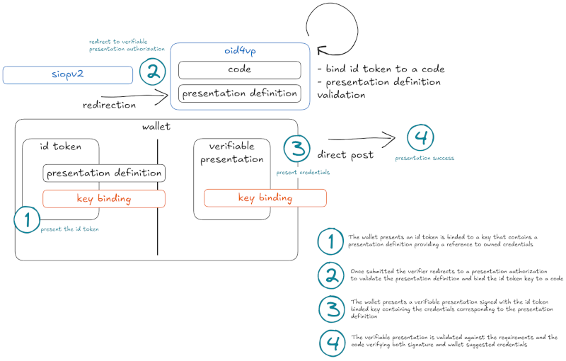

# (WIP) Wallet initiated presentation proposal

## Abstract

Open ecosystems may give every actor of a decentralized transaction, issuer,
wallet, and verifier the ability to keep its sovereignty while accepting
others without restriction but the one given by the latter. This draft discuss
a possible protocol enabling to have both properties according to verifiable
presentations. This would give the opportunity for verifiers to be open in what
they accept, closed in their requirements.

## Motivation

The current specifications are already open, the `dcql_query` being a parameter
for presentation authorization requests. The security considerations according
to such a presentation definition may close the requestor to any device. The
idea is here to bind that presentation definition to a wallet and ensure it is
the source of the according presentation. This would open the wallet set
keeping the verifier integrity with restrictions to accept by extension
credentials of variable formats.

To bind a presentation definition to a wallet, a back channel can be added
while conserving the front channel continuation to bind the presentation to the
same device. Those bindings give discrete claims or credentials set owned by an
holder from a given wallet to present. Contrary to a presentation definition
originated by a verifier, this helps to assert the claims / credentials
ownership by the holder and that the presentation is in accordance with the
declarative behavior of the flow.

## Suggested design

While SIOPV2 provide the ability to present id tokens, those are binded to a
wallet and can contain additionnal claims such as a presentation definition.
The main idea would be to respond with a redirection toward an according
verifiable presentation authorization URL with the binded `dcql_query` and to a
code as request parameter. That would help carry id token information for later
use. The verifier would then have the ability to validate the presentation
definition to meet its requirements.



## About decentralization

POST method helps to send a representation from a client to a server. SIOPV2
and OpenID4VP introduce direct_post that aims for a client to have server
abilities to send content that preserve transaction context to enable the
exchange. This permits decentralization in the interaction on top of the
transport layer. Here we introduce decentralization in semantic contribution
where the wallet controls the semantics of the presentation transfered to the
relying party. Those semantics are restricted to verifier requirements.

## Specifications additions

### 1. SIOPv2: Presentation Definition in ID Tokens

The SIOPv2 specification would define an OPTIONAL presentation_definition claim
for Self-Issued ID Tokens.

`presentation_definition`: OPTIONAL. A JSON object describing credentials and
claims that the Self-Issued OP is willing and able to present in a subsequent
OpenID4VP transaction. The presentation definition is wallet-originated. It
describes a holder presentation capability and MUST NOT be interpreted as
modifying the verifier’s acceptance policy.

For example:
```
{
  [...]
  "nonce": "n-0S6_WzA2Mj",
  "presentation_definition": {
    "format": "dcql",
    "query": {
        "credentials": [
            {
                "id": "oauth-security-badge",
                "format": "jwt_vc_json",
                "claims": [
                    {
                        "path": [
                            "credentialSubject",
                            "achievement",
                            "id"
                        ]
                    }
                ]
            }
        ]
    }
  }
}
```

A Self-Issued OpenID Provider including this claim:
- MUST obtain End-User consent.
- MUST bind the ID Token to the intended verifier through aud.
- MUST include the nonce received in the authorization request.
- MUST sign the complete ID Token using a holder key.
- SHOULD use a short expiration time.
- SHOULD include a unique jti.

A verifier receiving the claim:
- MUST validate the ID Token before processing the definition.
- MUST treat the definition as wallet-controlled input.
- MUST evaluate it against its independent acceptance policy.
- MUST NOT infer credential validity, possession or issuer trust from the definition alone.
- MAY accept it completely, accept a subset or reject it.

### 2. SIOPv2 continuation toward OpenID4VP

When the verifier accepts all or part of a wallet-originated presentation
definition, it MAY construct and redirect the user-agent to an OpenID4VP
authorization request containing an authoritative dcql_query.

Conceptually:

```
accepted DCQL query = wallet Presentation Definition ∩ verifier policy
```

The Wallet defines what it can present. The Verifier defines what it will
accept. The resulting dcql_query remains a Verifier-originated request under
OpenID4VP.

The request would contain:

```
{
  "client_id": "https://verifier.example",
  "response_type": "vp_token",
  "response_mode": "direct_post",
  "response_uri": "https://verifier.example/presentation-response",
  "code": "N2h4QmF5b2xXc1N6",
  "nonce": "fresh-openid4vp-nonce",
  "dcql_query": {
    "credentials": [
      {
        "id": "oauth-security-badge",
        "format": "jwt_vc_json",
        "claims": [
          {
            "path": [
              "credentialSubject",
              "achievement",
              "id"
            ]
          }
        ]
      }
    ]
  }
}
```

### 3. OpenID4VP: optional authorization code

`code`: OPTIONAL. An opaque, short-lived and single-use value issued after a
Verifier accepts a wallet-originated presentation definition. It binds the
subsequent OpenID4VP transaction to the preceding SIOPv2 transaction.

When issuing the code, the Verifier MUST associate it with:
- The validated Self-Issued ID Token.
- The Wallet public client identifier.
- The accepted Presentation Definition.
- The authoritative DCQL query.
- The intended Verifier.
- The definition identifier or digest.
- An expiration time.

The Wallet returns it as direct post query parameter:

```
POST /presentation-response HTTP/1.1
Host: verifier.example
Content-Type: application/x-www-form-urlencoded

vp_token=...&
code=N2h4QmF5b2xXc1N6&
state=eyJhb...6-sVA
```

The Verifier MUST then:
- Resolve the code to an active transaction.
- Verify the VP against the accepted definition and DCQL query.
- Verify the OpenID4VP audience and nonce.
- Verify continuity with the key used by the Self-Issued ID Token.
- Atomically consume the code.
- Reject expired, unknown, reused or mismatched codes.

### 4. OpenID4VP: Verifier metadata

```
{
  "id_token_presentation_definition_supported": true,
  "presentation_definition_formats_supported": [
    "dcql"
  ],
  "presentation_definition_binding_methods_supported": [
    "authorization_code"
  ]
}
```

## Security considerations

| Security improvement                    | Current OpenID4VP                                                               | Proposed addition                                                                    |
| --------------------------------------- | ------------------------------------------------------------------------------- | ------------------------------------------------------------------------------------ |
| Wallet-originated declaration integrity | The Verifier authors the DCQL query                                             | The Wallet signs its Presentation Definition in a Self-Issued ID Token               |
| Same-Wallet continuity across protocols | Binds the VP to the OpenID4VP request                                           | Binds the preceding SIOPv2 response and subsequent VP to the same Wallet key         |
| Cross-step transaction binding          | Covers one OpenID4VP transaction                                                | Connects SIOPv2, accepted definition, DCQL request and VP through a single-use code  |
| Definition immutability                 | Protects the Verifier’s Request Object                                          | Protects the Wallet definition and prevents alteration after Verifier acceptance     |
| Verifier policy preservation            | Verifier directly specifies requirements                                        | Verifier safely evaluates Wallet suggestions without delegating acceptance policy    |
| Credential-level capability negotiation | Wallet can communicate technical capabilities                                   | Wallet can declare credentials and claims it is willing and able to present          |
| Controlled extensibility                | Verifier must anticipate credential queries                                     | Unknown credentials may be proposed without being automatically trusted              |
| Pre-presentation filtering              | Evaluation primarily occurs from the Verifier’s query and returned presentation | Verifier can reject an unsuitable definition before credentials are disclosed        |
| Declarative/proof correspondence        | Wallet answers an existing query                                                | Final VP can be checked against the Wallet’s preceding signed declaration            |
| Reduced unsolicited disclosure          | Wallet selects credentials matching the query                                   | Wallet declares intended disclosure before the Verifier requests the accepted subset |
